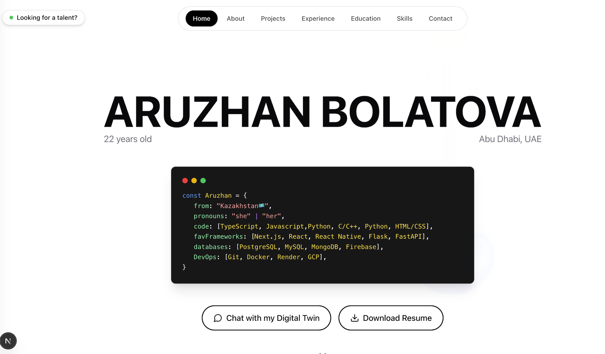

# Aruzhan's AI Portfolio 🤖✨



**Static portfolios are dead.**  
This is an interactive AI-powered portfolio that adapts to *you*.  
Ask a question — my AI avatar replies instantly.

## 👇 What can you ask?

- 🧠 **Tech recruiter?** Ask about my stack & results  
- 💻 **Dev?** Dive into my code & mindset  
- 🧑‍🤝‍🧑 **Friend or family?** See what I've been working on  

---

This is not a portfolio.  
It's a **conversation tailored to your curiosity**.

## 🚀 How to run

Want to run this project locally? Here's what you need:

### Prerequisites
- **Node.js** (v18 or higher)
- **pnpm** package manager
- **Google Gemini API token** (for AI chat functionality)

### Setup
1. **Clone the repository**
   ```bash
   git clone https://github.com/aruzhan-bolatova/portfolio_website.git
   cd portfolio_website
   ```

2. **Install dependencies**
   ```bash
   pnpm install
   ```

3. **Environment variables**
   Create a `.env` file in the root directory:
   ```env
   GOOGLE_GENERATIVE_AI_API_KEY=<your_api_key>
   ```

4. **Run the development server**
   ```bash
   pnpm dev
   ```

5. **Open your browser**
   Navigate to `http://localhost:3000`

### Getting your **tokens**
- **Gemini API Key**: Get it from [aistudio.google.com](https://aistudio.google.com/api-keys)
